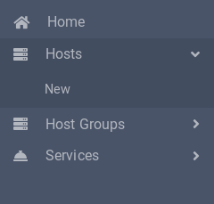
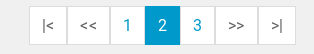

# negotiated-output-components
Set of HTML components to be used with the negotiated-output templating system

## menu.ul

menu.ul transforms a menu definition into a menu defined as an recursing unordered list, suitable for producing main menus:

### Example code

    \sergiosgc\output\Negotiated::$singleton->template('/_/sergiosgc/menu.ul/', [
        'menu' => [ 'items' => [
            [
                'href' => '/',
                'active' => true,
                'label' => _('Home')
            ],
            [
                'href' => '/hosts/',
                'label' => _('Hosts'),
                'submenu' => [
                    [
                        'href' => '/host/new/',
                        'label' => _('New')
                    ]
                ]
            ],
            [
                'href' => '/host-groups/',
                'label' => _('Host Groups'),
                'submenu' => [
                    [
                        'href' => '/host-group/new/',
                        'label' => _('New')
                    ]
                ]
            ],
            [
                'href' => '/services/',
                'label' => _('Services'),
                'submenu' => [
                    [
                        'href' => '/service/new/',
                        'label' => _('New')
                    ]
                ]
            ],
        ]
    ]);

### Argument specification

menu.ul acts on a template `menu` variable. This is an associative array, with an `items` entry defining the menu.

The `items` entry is an array of menu entries. Each menu entry is an associative array with a mandatory `label` and optional:
* **href** Link to be applied to label
* **active** Whether the menu entry is active
* **submenu** A submenu definition, as an array of menu entries.

## paginator
paginator produces a paginator, similar to this:

### Example code

    \sergiosgc\output\Negotiated::$singleton->template('/_/sergiosgc/paginator/',
        [ 'paginator' => [
            'page' => $currentPage,
            'pageCount' => $pageCount,
            'visible' => 3,
            'queryArgumentsWhitelist' => [ 'q' ]
    ]]);

### Argument specification

paginator will act on a `paginator` template variable. This variable is an associative array with these mandatory parameters:

* **page** The current page
* **pageCount** The total number of pages

Additionally, these optional parameters may be defined:
* **class** HTML class for the paginator. Defaults to `paginator`.
* **visible** How many pages are visible. Defaults to 3.
* **linkHref** `\sergiosgc\sprintf` conversion specifier for generating page links. Conversion specifiers my refer to `page` for the linked page, as well as any variable defined in the paginator template variable. Defaults to %&lt;page&gt;
* **linkLabel** `\sergiosgc\sprintf` conversion specifier for generating page link labels. Conversion specifiers my refer to `page` for the linked page, as well as any variable defined in the paginator template variable. Defaults to %&lt;page&gt;
* **startLinkLabel** Label for the link to page 1. Defaults to `|<`.
* **endLinkLabel** Label for the link to the last page. Defaults to `>|`.
* **skipUpLinkLabel** Label for the link for skipping **visible** pages up. Defaults to `>>`.
* **skipDownLinkLabel** Label for the link for skipping **visible** pages down. Defaults to `<<`.
* **preserveQueryArguments** Should links include query arguments? True/False, defaults to false.
* **queryArgumentsWhitelist** If preserveQueryArguments is false, nevertheless append query arguments in this array to generated links. Defaults to an empty array.
* **queryArgumentsBlacklist** If preserveQueryArguments is true, nevertheless skip appending query arguments in this array to generated links. Defaults to an empty array.

## propertylist.table
propertylist.table transforms an associative array of properties `[ 'property' => $value ]` into a table with one property per row and two columns per row (label and value). Example output:

### Example code

    \sergiosgc\output\Negotiated::$singleton->template('/_/sergiosgc/propertylist.table/',
        [ 'property-list' => [
            'class' => 'hostgroup-view',
            'properties' => [
                'name' => [ 'label' => _('Name') ],
                'parent' => [ 'label' => _('Parent') ],
                'action' => [
                    'label' => _('Actions'),
                    'links' => [
                        [
                            'href' => '/host-group/edit/%<id>',
                            'label' => _('Edit')
                        ],
                        [
                            'href' => '/host-group/%<id>?x-verb=DELETE',
                            'class' => 'delete',
                            'label' => _('Delete')
                        ]
                    ]
                ]
            ],
            'value' => $hostGroup
    ]]);

### Argument specification

propertylist.table will act on the template variable `property-list`. This variable is an associative array containing these entries:
* **class**(optional) The HTML class of the resulting table
* **properties** Associative array of properties. Each property produces one row in the table. Each property is one of:
  * Value property. The key matches the a key in `property-list/value` and the value is an associative array optionally containing a `label` entry.
  * Link set property. The key is irrelevant. The content is an associative array containing an optional `label` and a mandatory `links`associative array. Each entry in the `links` array contains:
    * **href** A format string to be fed into `\sergiosgc\sprintf` along with the `property-list/value` array, for producing the link href. You may use named conversion specifiers, as per the `\sergiosgc\sprintf` documentation.
    * ***label*** The link label
    * ***class***(optional) The link class
* **value** An associative array (or \ArrayAccess instance) of values. You must include values for value properties defined in `property-list/properties`. You may include extra values, namely for consumption by conversion specifiers in generating links.
