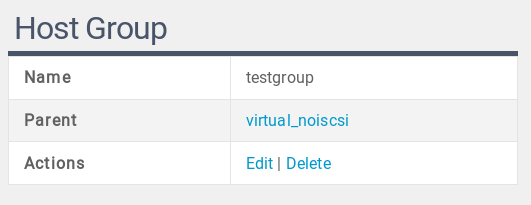

# negotiated-output-components
Set of HTML components to be used with the negotiated-output templating system

## propertylist.table
propertylist.table transforms an associative array of properties `[ 'property' => $value ]` into a table with one property per row and two columns per row (label and value). Example output:

Example code: 

    \sergiosgc\output\Negotiated::$singleton->template('/_/sergiosgc/propertylist.table/',
        [ 'property-list' => [
            'class' => 'hostgroup-view',
            'properties' => [
                'name' => [ 'label' => _('Name') ],
                'parent' => [ 'label' => _('Parent') ],
                'action' => [
                    'label' => _('Actions'),
                    'links' => [
                        [
                            'href' => '/host-group/edit/%<id>',
                            'label' => _('Edit')
                        ],
                        [
                            'href' => '/host-group/%<id>?x-verb=DELETE',
                            'class' => 'delete',
                            'label' => _('Delete')
                        ]
                    ]
                ]
            ],
            'value' => $hostGroup
    ]]);

Argument specification:

propertylist.table will act on the template variable `property-list`. This variable is an associative array containing these entries:
* **class**(optional) The HTML class of the resulting table
* **properties** Associative array of properties. Each property produces one row in the table. Each property is one of:
** Value property. The key matches the a key in `property-list/value` and the value is an associative array optionally containing a `label` entry.
** Link set property. The key is irrelevant. The content is an associative array containing an optional `label` and a mandatory `links`associative array. Each entry in the `links` array contains:
*** **href** A format string to be fed into `\sergiosgc\sprintf` along with the `property-list/value` array, for producing the link href. You may use named conversion specifiers, as per the `\sergiosgc\sprintf` documentation.
*** ***label*** The link label
*** ***class***(optional) The link class
* **value** An associative array (or \ArrayAccess instance) of values. You must include values for value properties defined in `property-list/properties`. You may include extra values, namely for consumption by conversion specifiers in generating links.
